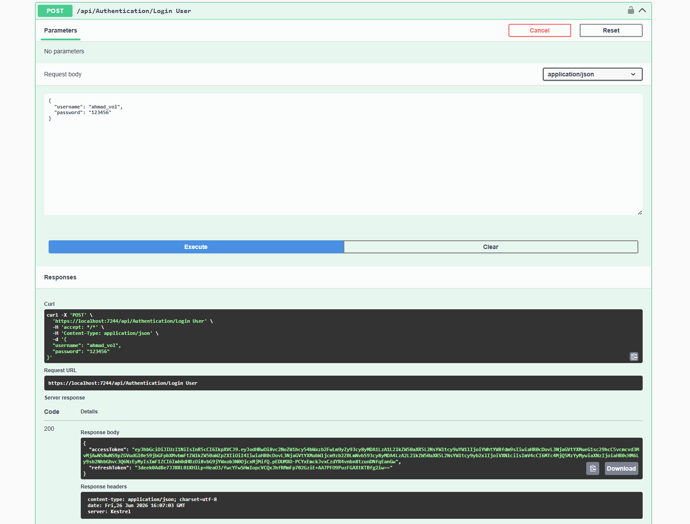
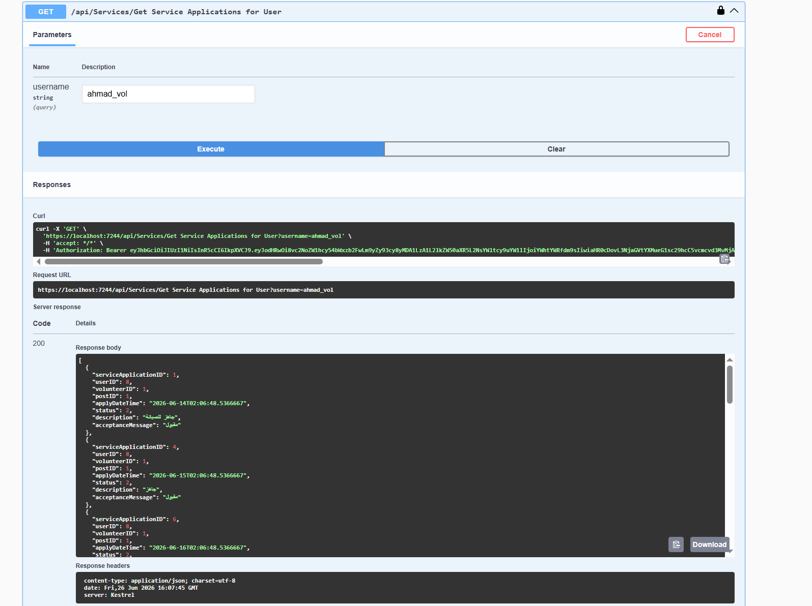

# Social Services Web API

A robust RESTful backend API built with ASP.NET Core, designed to manage social services, volunteer operations, and application processing. 

## API Documentation & Testing

## Tech Stack
* **Framework:** ASP.NET Core Web API (C#)
* **ORM:** Entity Framework Core
* **Database:** SQL Server
* **Security:** JSON Web Tokens (JWT) for secure authentication and authorization

## Architecture & Security
This backend is structured to provide secure, scalable, and efficient data operations:
* **JWT Authentication:** Implements stateless, token-based security ensuring that sensitive endpoints (like retrieving user applications) are only accessible to authorized users.
* **RESTful Principles:** Endpoints are logically structured for standard CRUD operations using appropriate HTTP verbs and status codes.
* **Data Access:** Utilizes Entity Framework Core for optimized database querying, ensuring strong typing and preventing SQL injection.

## Key Features
* **User & Volunteer Management:** Endpoints to register, authenticate, and manage users and their roles within the social services system.
* **Service Applications:** Secure tracking of service requests, status updates, and acceptance messaging.
* **Interactive API Docs:** Fully integrated Swagger UI for seamless testing and endpoint exploration.

## Local Setup
1. Clone the repository.
2. Update the SQL Server connection string in `appsettings.json`.
3. Open the Package Manager Console and run `Update-Database` to apply EF Core migrations.
4. Run the application to launch the Swagger UI in your browser.